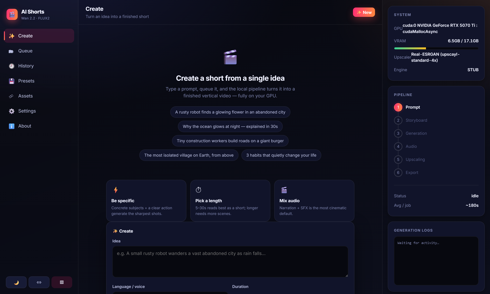
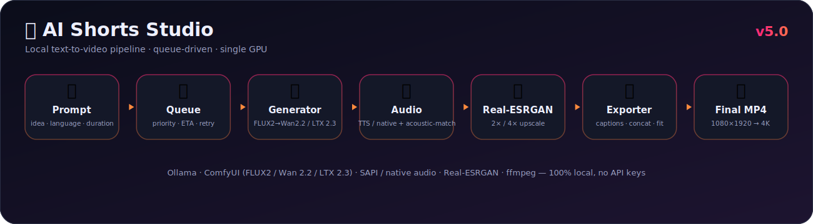

<div align="center">


# AI Shorts Studio — Wan 2.2

**Type an idea → get a captioned 9:16 short, produced entirely on your own GPU.**
No cloud. No API keys. No prompt ever leaves your machine.

[](https://github.com/ingridtoulotte/ai-shorts-generator-local/actions/workflows/ci.yml)
[](https://github.com/ingridtoulotte/ai-shorts-generator-local/releases)


<sub>Real output — local FLUX2 → Wan 2.2, captioned, exact-duration.</sub>

</div>

> **Sister project:** [AI Shorts Studio — LTX 2.3](https://github.com/ingridtoulotte/ai-shorts-generator-local-ltx) — LTX 2.3 image-to-video with **native generated audio**.

---

## What it does

| | |
|---|---|
| 🗂 **Creator queue** | Stack jobs; run one-by-one on a single GPU. Priority, reorder, ETA, auto-retry, restart-persistent, live status. |
| ♾️ **Continuation** | Extend any clip: last frame → Real-ESRGAN upscale → image-to-video → seamless stitch. +1 / +3 / +5 / +10 segments. |
| 🔊 **Named audio modes** | 🎙 Full Narration · 🔊 Full SFX · 🎬 Narration + SFX — understandable controls, not A/B/C/D. |
| ✨ **Real-ESRGAN upscale** | Optional 2× / 4× output upscale with live VRAM / time / resolution estimates (ffmpeg-lanczos fallback). |
| 🎚 **Acoustic match** | Continuations are loudness-matched to the seed clip so the extension sounds like the same video. |
| 🌐 **Exact duration & language** | Script, voice-over and subtitles follow the chosen language; output length matches the request exactly. |
| 🖥 **TypeScript UI** | Vite + strict TypeScript, component architecture — sidebar nav, workspace, live info panel, animated pipeline, history. |

<div align="center"></div>

---

## Architecture

<div align="center">
<picture>
  <source media="(prefers-color-scheme: light)" srcset="docs/architecture-light.svg" />
  
</picture>
</div>

`jobqueue.js` drives everything one job at a time with cancellation, retry,
persistence and live SSE status. Each stage is a small module under `pipeline/`.
Swap the engine with `GEN_ENGINE` (`wan` | `ltx` | `stub`).

---

## Wan vs LTX

| Feature | **Wan 2.2** (this repo) | **LTX 2.3** (sister) |
|---|:---:|:---:|
| Native generated audio | — (SAPI voice-over) | ✅ |
| Continuation / extend | ✅ | ✅ |
| Creator queue | ✅ | ✅ |
| Real-ESRGAN upscale | ✅ | ✅ |
| Acoustic match | ✅ | ✅ |
| Burned-in subtitles | ✅ | — (native audio) |

---

## Quick start

```bash
git clone https://github.com/ingridtoulotte/ai-shorts-generator-local
cd ai-shorts-generator-local
npm install
npm start            # http://localhost:3000  (serves the prebuilt UI in dist/)
```

GPU-free dry run (color clips, no ComfyUI): `GEN_ENGINE=stub npm start`.

**Develop the UI:** `npm run ui:dev` (Vite on :5173, proxies the API to :3000).
**Rebuild the UI:** `npm run build` → `dist/`. **Type-check:** `npm run typecheck`.

### Requirements
- **Node.js ≥ 20**, **Windows** (for SAPI voice-over).
- **ComfyUI** on `http://127.0.0.1:8188` with FLUX2 + Wan 2.2 I2V models (workflows in `pipeline/workflows/`).
- **Ollama** (optional) for higher-quality scripts; deterministic offline fallback otherwise.
- **ffmpeg** bundled via `ffmpeg-static`. **Real-ESRGAN** auto-detected (Upscayl build) or set `REALESRGAN_BIN`.

---

## API

| Method | Route | Purpose |
|---|---|---|
| `POST` | `/generate` | enqueue `{idea, voice, duration, priority, audioMode, upscale}` |
| `POST` | `/continue` | enqueue `{seedVideoUrl, idea, segments, segDurationSec, smooth, upscale, acousticMatch}` |
| `GET`  | `/queue` · `/events` | snapshot · live SSE stream |
| `POST` | `/queue/:id/{cancel,remove,reorder,priority}` | per-job control |
| `POST` | `/queue/{pause,resume,cancel-all,clear-finished}` | queue control |
| `GET`  | `/api/capabilities` | engine, audio modes, upscaler, resolution (UI driver) |
| `GET`  | `/api/upscale-estimate` | output resolution / VRAM / time for a scale |
| `GET`  | `/api/stats` | VRAM / GPU snapshot (via ComfyUI) |

`audioMode`: `narration` · `sfx` · `narration_sfx` (legacy `A/B/C/D` still accepted). `upscale`: `0` · `2` · `4`.

---

## Configuration (env)

`GEN_ENGINE`, `COMFYUI_URL`, `COMFYUI_DIR`, `OLLAMA_URL`, `LLM_MODEL`,
`VIDEO_FPS`, `GEN_WIDTH`/`GEN_HEIGHT`, `OUT_WIDTH`/`OUT_HEIGHT`,
`MIN_SCENES`/`MAX_SCENES`, `SPEECH_WPS`, `DURATION_TOLERANCE_SEC`,
`REALESRGAN_BIN`/`REALESRGAN_MODELS`/`REALESRGAN_MODEL`. See `pipeline/config.js`.

---

## Testing

```bash
GEN_ENGINE=stub node test/batch_test.mjs     # whole pipeline, GPU-free
GEN_ENGINE=stub node test/queue_test.mjs      # queue + cancel + continuation
npm run typecheck && npm run build            # strict TS + UI bundle
```

CI runs the stub batch + queue tests, type-check and UI build on every push.
Verified with real generation: en/10s → 10.07s, fr/18s → 18.00s, 1080×1920,
exact duration; Real-ESRGAN 1080→2160 per frame; acoustic match within ~0.1 LU.

---

## License

MIT. Built on the structure of `theot44240-tech/Ai-video-generator`, rebuilt into
a fully-local, queue-driven studio. Generation via ComfyUI + FLUX2 + Wan 2.2;
ffmpeg via `ffmpeg-static`; upscale via Real-ESRGAN.
